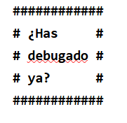

# kata-words-frame
**Kata 42 per l'especialitat fullstackPHP 11-7-24**

 Crea una funció que rebi un text i mostri cada paraula en una línea,
 formant un marc rectangular de almohadillas("#").

 **Input**
 ¿Has debugado ya?

 **Output**

   
**Bonus track: Haz lo mismo pero enmarcando con el símbolo de Batman**

Aquest exercici està basat en [Retos de Programación de Mouredev](https://retosdeprogramacion.com/ejercicios). Concretament el #31 de 2022.